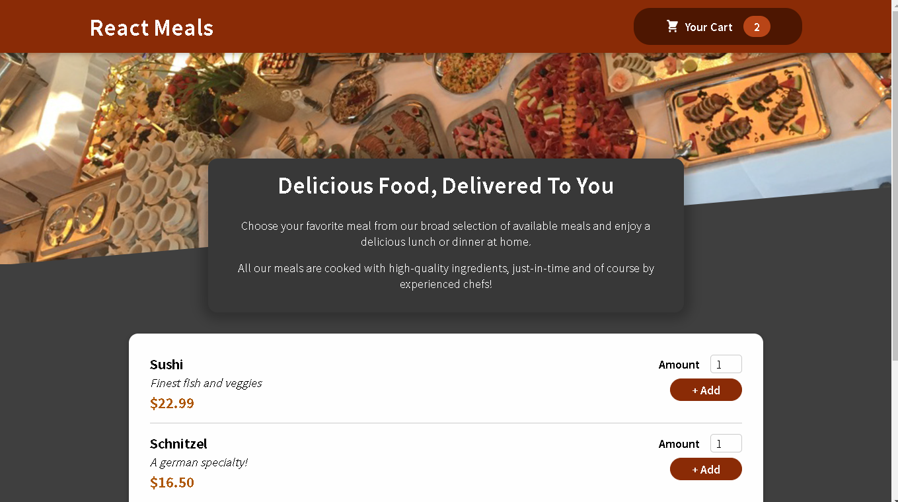

# My Food Order App made with REACT JS ⚛

## Description of the project

This is a web application that I programmed as a tutorial from my React Udemy Course (Chapter-11). Basically the app allows you to buy 4 different meals from a restaurant, you pick the amount of that meal to the shopping cart 🛒, and in the app the shopping cart icon button will show how many meals you are intended to purchase, e.g in the app screenshot bellow we see two meals added to the cart.

<p>
  
  <br>
  <em>First view of the web app</em>
</p>

To see the Cart content you click the Cart icon button in the top right corner of the screen, once you do it, you can see all the items you purchased on your order, see the image bellow showing all the items added to the cart, once you see the list you can remove or add more meals one by one.

<p>
  
  <br>
  <em>View of the shopping cart content</em>
</p>

# React Tool used

This was a very funny activity, I applied a lot of react concepts such as...

- `useState()`, `useReducer()` hooks.
- `useEffect()` hook.
- Context API with `useContext()` hook.
- Conditional and List rendering.
- CSS modules styles.
- React portals.
- Forward refs.
- Image importing, etc, etc...

# How to run it?

Once you clone this repo just type the following commands on your terminal:

```
$ npm install
$ npm start
```

go to [http://localhost:3000/](http://localhost:3000/) and try the web app :).

# Acknowledgements

Thanks to ([Maximilian Schwarzmüller](https://www.linkedin.com/in/maximilian-schwarzmueller/)) and his great React course on Udemy from where I extracted this content [Complete React Course](https://www.udemy.com/course/react-the-complete-guide-incl-redux/). I am learning a lot 👍.
